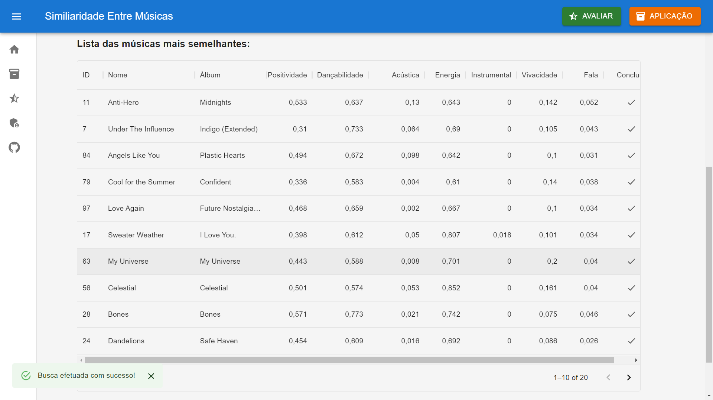

# Aplicativo Proposto para Similaridade entre Músicas em Plataformas de Streaming

### Uma Abordagem via Metaheurísticas BRKGA e KNN PARA O Problema de Minimização da Soma das Diversidades

### Aplicação construída durante a pesquisa de Iniciação Científica intitulada “ Similaridade entre Músicas em Plataformas de Streaming: Uma Abordagem via Metaheurísticas BRKGA e KNN PARA O Problema de Minimização da Soma das Diversidades", no período de 03/2022 à 03/2023, ofertada na Universidade Federal de Ouro Preto, durante minha graduação em Sistemas de Informação.

### O algoritmo BRKGA empregado no Backend da aplicação esta disponível no seguinte repositório: <a  href="https://github.com/rfrancotoso/brkgaAPI/tree/master/examples/api-usage">Clique aqui</a>

 

# Problema apresentado

### O constante crescimento no mundo de streaming, com novas músicas, variações das já existentes e mais uma gama de alternativas, um modelo de recomendação de músicas com as características semelhantes é proposto para minimizar/demonstrar a similaridade em um grupo determinado de músicas.

 

# Funcionamento (resumo)

### No aplicativo em questão, é feita uma extração de dados de uma determinada playlist na plataforma Spotify (utilizando a biblioteca para Python, Spotipy), retornando 7 atributos variáveis que são medidos pelo próprio Spotify, dentre eles estão: Acústica, Dançabilidade, Energia, Índice Instrumental, Discurso, Valência e Vivacidade. Obs. Cada atributo possuí uma variação de 0 (onde se entende que a presença do atributo é nulo) até 1 (presença total).

 

### Com os dados extraídos, é feito um cálculo de distâncias de uma música para a outra, na forma euclidiana.

 

### Com os dados extraídos e feito os cálculos, é empregado o algoritmo BRKGA para encontrar dentre um determinado grupo de músicas, com base em seus atributos, quais músicas são mais semelhantes entre si.

 

# Tecnologias empregadas

<ul>
    <li>React e TypeScript</li>
    <li>FastAPI e Python</li>
    <li>PostgreSQL</li>
    <li>Spotipy API para extração de dados</li>
    <li>BRKGA (Rodrigo Franco Toso and Mauricio G.C. Resende) e C++</li>
    <li>Biblioteca Material UI para Layout da aplicação.</li>
</ul>

 

# Apresentção do aplicativo

## Tela Inicial

### Na tela inicial, o usuário deve entrar com o link da playlist do Spotify, selecionar o total de músicas e escolher dentre esse total a quantidade que lhe desejar de músicas mais semelhantes entre si.

 

 

## Faixa Personalizada

### Como forma de deixar o aplicativo mais interativo, existe a possibilidade de adicionar uma faixa extra para entrar no cálculo, definindo suas variáveis como preferir.

 

 

## Resultados

### Quando for feita a busca, será renderizado uma tabela com as músicas mais semelhantes entre si, contendo seus respectivos atributos na tabela.

 

 

## Capas das músicas selecionadas

### A partir dos resultados, é feito uma busca das músicas selecionadas e listadas com nome, artista, capa da música e um link na qual redireciona direto para o Spotify.

 

 

# Carências do projeto

## Liberar para o público

### A ideia era hospedar o projeto de forma em que todos os estudantes da UFOP pudessem ter acesso à aplicação direto do seu navegador, sem precisar instalar qualquer tipo de programa ou afins. Mas por falta de estrutura, até o presente momento (11/2022), não tivemos a oportunidade de deixar público a aplicação.

 

## Avaliação do usúario

### Com a ideia de deixar público, foi proposto um campo para avaliação do usuário e dessa forma, podermos avaliar a eficacia da aplicação.

 

 

## Página do Administrador

### Foi proposto uma página do administrador, para gerenciar e coletar as avaliações deixadas pelos usuários.

 

 

# Conclusão

### A aplicação desenvolvida tem o propósito de trazer vida para a pesquisa de Iniciação Científica em questão, com uma interface amigável e cheia de cores. O maior desafio foi justamente integrar o Backend da aplicação, no qual foi desenvolvido em C++, com o Frontend na qual foi desenvolvido em React e TypeScript. Utilizando uma API do tipo REST, desenvolvida em Python, foi possível tal feito, talvez não de forma mais padronizada, mas de uma forma funcional e que no final, deu certo.

 

### No futuro, talvez, será possível aperfeiçoar e subtrair as carências apresentadas no projeto.
